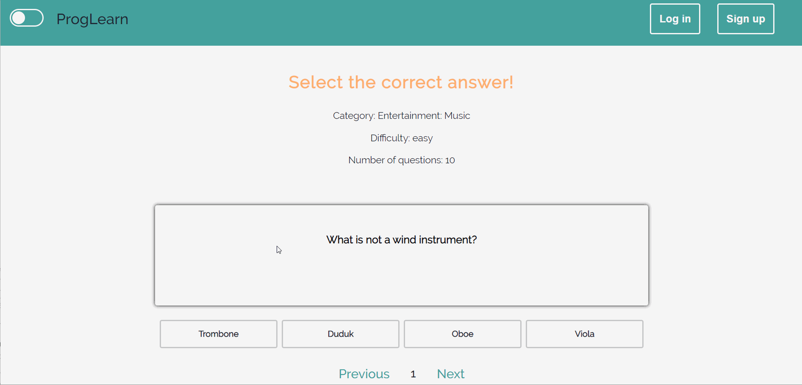

# ProgLearn-Frontend - React.js

This project was bootstrapped with [Create React App](https://github.com/facebook/create-react-app).

## The project

This repository contains the frontend for the website called ProgLearn (similar to [Quizlet](https://www.quizlet.com/) learning website). This project is still under development (started in June, 2020) and it aims to create a "one-pager" website that displays the ProgLearn web application. 

### Used technologies

⚬ [Node.js](https://nodejs.org/en/) 
⚬ [JavaScript](https://developer.mozilla.org/en-US/docs/Web/JavaScript) 
⚬ Context API 
⚬ React Hooks 
⚬ Styled-Components 

ProgLearn is a web application made for learning about various topics in a playful manner. By registraion you can create your personal quiz sets. You can choose from the following learning categories: 
⚬ Multiple choice quiz 
⚬ Flashcards 

## Demo

## Backend

The ProgLearn frontend that acts as the business logic layer for the project is available at the following link: [ProgLearn-Backend](https://github.com/AnnaCzinege/ProgLearn-Backend)

## How to run

First of all, Node.js have to be installed on your system to run the React application.

To be able to run the React application you have to follow these simple steps:

After cloning the repository, run `npm install` to get all the necessary Node packages.
Run `npm start` and the application will run.

## Contributors

⚬ [Anna Czinege](https://github.com/AnnaCzinege) 

**Under development**
